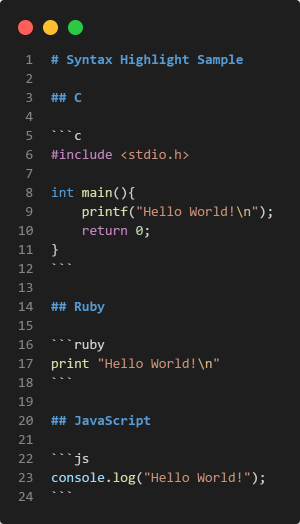
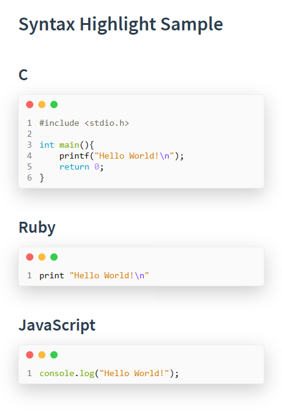
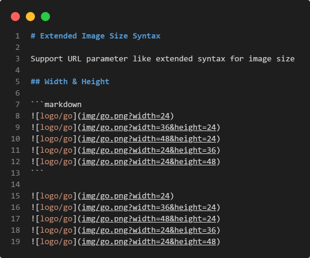
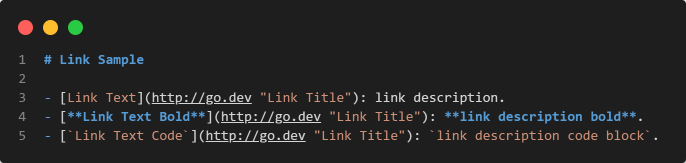
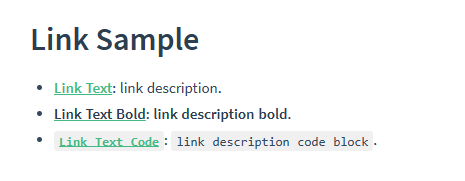
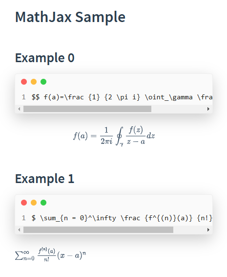
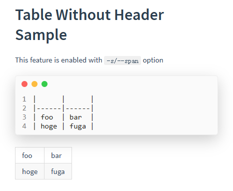
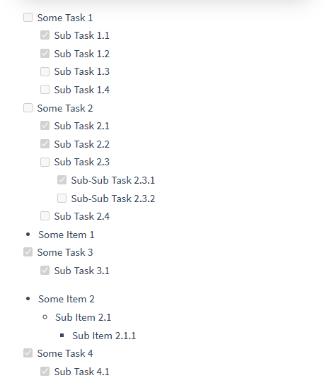

<!--suppress ALL-->
<p align="center">

</p>
<h1 align="center">md-html-cli</h1>

<p align="center">
 
 
 
 
 
 
 

</p>

<p align="center">
用于将 markdown 转换为单个 html 文件的 CLI 实用工具。
<br>
<b>🇨🇳 中文</b> | <a href="README.md">🇺🇸 English</a>
</p>

## 安装

安装 Go 语言 `1.17` 或以上版本，然后执行以下命令：

```shell
go install github.com/GoAid/md-html-cli@latest
```

## 用例

```shell
go run github.com/GoAid/md-html-cli@latest /?
```

```shell
Usage:
  go run github.com/GoAid/md-html-cli@latest [OPTIONS]

Application Options:
  /i, /input:            input Markdown
  /o, /output:           output HTML
  /l, /lang:             html lang attribute value, default is en
  /t, /title:            custom html title, default is output file name
  /f, /favicon:          favicon image path, if embed is used, will embed by base64 encoding
  /e, /embed             embed image by base64 encoding
      /center            whether to center the image
  /m, /mathjax           use MathJax
  /s, /span              enable table row/col span
  /b, /border:           add a border style of a specified color to image labels, e.g. gray, #eee, rgb(0,0,0)
  /c, /css:              custom css file path
      /theme:[vue|side]  output HTML theme
      /toc               generate TOC
  /g, /gen               use HTML comments to record generation time

Help Options:
  /?                     Show this help message
  /h, /help              Show this help message
```

### 样例

[GitHub Pages](https://GoAid.github.io/md-html-cli/index.html)

此 html 页面由以下命令生成：

```bash
md-html-cli -i "example/*.md" -o gh-pages/index.html -l en -t "Example Page" -f example/img/go.png -ems -c example/css/custom-css.css --theme vue --toc --gen
```

### 示例

<details>
<summary>预览</summary>

| Markdown                                                                            | HTML                                                                                    |
|-------------------------------------------------------------------------------------|-----------------------------------------------------------------------------------------|
|                        |                        |
|                                |                                |
|                      |                      |
|                                  |                                  |
|                            |                            |
|                      |                      |
|  |  |
|                        |                        |

</details>

## 开发

### 主题模板

在 `theme` 文件夹中创建用于存放主题模板文件的文件夹，
并在文件夹中创建同名的 `.gohtml` 类型模板文件。

### 模板变量

| 变量                           | 说明                       |
|------------------------------|--------------------------|
| `{{ .HTMLLang }}`            | HTML 语言属性值，如 `en`、`zh` 等 |
| `{{ .HTMLTitle }}`           | HTML 自定义标题，默认为输出文件名称     |
| `{{ if .Favicon }}{{ end }}` | 是否添加 `favicon.ico`       |
| `{{ .FaviconHref }}`         | `favicon.ico` 标签元素       |
| `{{ if .TOC }}{{ end }}`     | 是否生成目录                   |
| `{{ if .CSS }}{{ end }}`     | 是否添加自定义样式                |
| `{{ .ConvertedCSS }}`        | 自定义样式标签和内容               |
| `{{ if .MathJax }}{{ end }}` | 是否使用 `MathJax` 渲染数学公式    |
| `{{ .MathJaxConfig }}`       | `MathJax` 配置文件 JS 标签元素   |
| `{{ .MathJaxTeXSVG }}`       | `MathJax` 渲染工具 JS 标签元素   |
| `{{ .ConvertedHTML }}`       | 转换后的 HTML 主内容            |
| `{{ .GeneratedAt }}`         | 记录生成时间的 HTML 注释          |

### 模板函数

| 函数                                                          | 说明                      |
|-------------------------------------------------------------|-------------------------|
| <code>{{ "&lt;!-- HTML 标签 --&gt;" &vert; safeHTML }}</code> | `safeHTML` 用于保留 HTML 注释 |
| <code>{{ "/* CSS 内容 */" &vert; safeCSS }}</code>            | `safeCSS` 用于保留 CSS 注释   |
| <code>{{ "/* JS 内容 */" &vert; safeJS }}</code>              | `safeJS` 用于保留 JS 注释     |

## 鸣谢

- <https://github.com/nocd5/md2html>
- <https://github.com/tscanlin/tocbot>
- <https://github.com/mathjax/MathJax>
- <https://github.com/shd101wyy/markdown-preview-enhanced>
- <https://github.com/PuerkitoBio/goquery>
- <https://github.com/jessevdk/go-flags>
- <https://github.com/yuin/goldmark>
