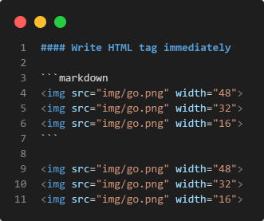

<p align="center">

</p>
<h1 align="center">md-html-cli</h1>
<p align="center">
CLI tool for converting markdown to a single html file.
<br>
<a href="README-zh.md">🇨🇳 中文</a> | <b>🇺🇸 English</b>
</p>

## Installation

Install Go language `1.17` or above, and then execute the following command:

```shell
go install github.com/GoAid/md-html-cli@latest
```

## Usage

```shell
go run github.com/GoAid/md-html-cli@latest /?
```

```shell
Usage:
  go run github.com/GoAid/md-html-cli@latest [OPTIONS]

Application Options:
  /i, /input:            input Markdown
  /o, /output:           output HTML
  /l, /lang:             html lang attribute value, default is en
  /t, /title:            custom html title, default is output file name
  /f, /favicon:          favicon image path, if embed is used, will embed by base64 encoding
  /e, /embed             embed image by base64 encoding
  /m, /mathjax           use MathJax
  /s, /span              enable table row/col span
  /c, /css:              custom css file path
      /theme:[vue|side]  output HTML theme
      /toc               generate TOC

Help Options:
  /?                     Show this help message
  /h, /help              Show this help message
```

### Sample

[GitHub Pages](https://GoAid.github.io/md-html-cli/index.html)

The html file is generated by following command

```bash
md-html-cli -i "example/*.md" -o gh-pages/index.html -l en -t "Example Page" -f example/img/go.png -ems -c example/css/custom-css.css --theme vue --toc
```

### Example

<details>
<summary>Preview</summary>

| Markdown                                                                            | HTML                                                                                    |
|-------------------------------------------------------------------------------------|-----------------------------------------------------------------------------------------|
|                        |                        |
|                                |                                |
|                      |                      |
|                                  |                                  |
|                            |                            |
|                      |                      |
|  |  |
|                        |                        |

</details>

## Development

### theme template

Create a folder for storing theme template files in the `theme` folder, 
and create a `.gohtml` type template file with the same name in the folder.

### template variable

| Variable                     | Description                                              |
|------------------------------|----------------------------------------------------------|
| `{{ .HTMLLang }}`            | HTML language attribute values, such as `en`, `zh`, etc. |
| `{{ .HTMLTitle }}`           | HTML custom title, the default is the output file name.  |
| `{{ if .Favicon }}{{ end }}` | Whether to add `favicon.ico`                             |
| `{{ .FaviconHref }}`         | `favicon.ico` tag element                                |
| `{{ if .TOC }}{{ end }}`     | Whether to generate a table of content                   |
| `{{ if .CSS }}{{ end }}`     | Whether to add a custom style                            |
| `{{ .ConvertedCSS }}`        | Customize style tag and content                          |
| `{{ if .MathJax }}{{ end }}` | Whether to use `MathJax` to render mathematical formulas |
| `{{ .MathJaxConfig }}`       | `MathJax` profile JS tag element                         |
| `{{ .MathJaxTeXSVG }}`       | `MathJax` rendering tool JS tag element                  |
| `{{ .ConvertedHTML }}`       | The converted HTML main content                          |

### template function

| Function                                                     | Description                                |
|--------------------------------------------------------------|--------------------------------------------|
| <code>{{ "&lt;!-- HTML tag --&gt;" &vert; safeHTML }}</code> | `safeHTML` is used to retain HTML comments |
| <code>{{ "/* CSS content */" &vert; safeCSS }}</code>        | `safeCSS` is used to retain CSS comments   |
| <code>{{ "/* JS content */" &vert; safeJS }}</code>          | `safeJS` is used to retain JS comments     |

## Acknowledgement

- <https://github.com/nocd5/md2html>
- <https://github.com/tscanlin/tocbot>
- <https://github.com/mathjax/MathJax>
- <https://github.com/shd101wyy/markdown-preview-enhanced>
- <https://github.com/PuerkitoBio/goquery>
- <https://github.com/jessevdk/go-flags>
- <https://github.com/yuin/goldmark>
