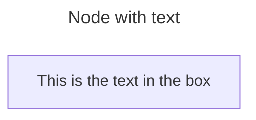
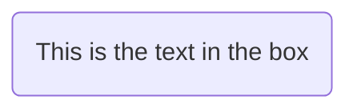
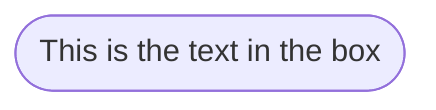
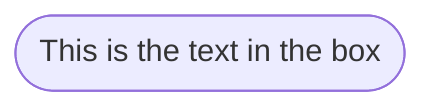
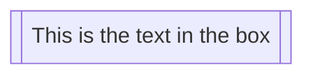
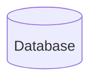
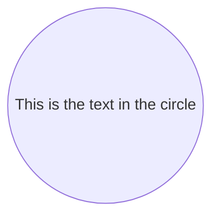
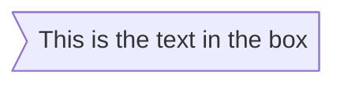
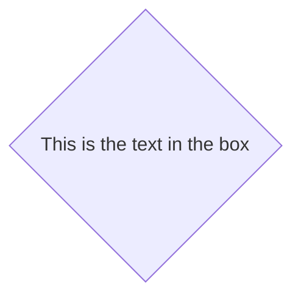
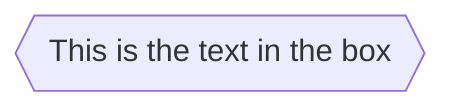

# Mermaid Diagram Sample

> For more information, please visit: <https://mermaid.js.org/intro/>

~~~markdown

~~~


## Mermaid Graph

~~~markdown

~~~


## Mermaid Flowcharts

### Mermaid Node shapes

<details>
<summary>Preview</summary>

~~~markdown

~~~


~~~markdown

~~~



~~~markdown

~~~


~~~markdown

~~~


~~~markdown

~~~


~~~markdown

~~~



~~~markdown

~~~


~~~markdown

~~~


~~~markdown
```mermaid
flowchart TD
    id1[/This is the text in the box/]

```
~~~

```mermaid
flowchart TD
    id1[/This is the text in the box/]
```

~~~markdown
```mermaid
flowchart TD
    id1[\This is the text in the box\]
```
~~~

```mermaid
flowchart TD
    id1[\This is the text in the box\]
```

~~~markdown
```mermaid
flowchart TD
    A[/Christmas\]
```
~~~

```mermaid
flowchart TD
    A[/Christmas\]
```

~~~markdown
```mermaid
flowchart TD
    B[\Go shopping/]
```
~~~

```mermaid
flowchart TD
    B[\Go shopping/]
```

~~~markdown
```mermaid
flowchart TD
    id1(((This is the text in the circle)))
```
~~~

```mermaid
flowchart TD
    id1(((This is the text in the circle)))
```

</details>

### Mermaid Links between nodes

<details>
<summary>Preview</summary>

~~~markdown
```mermaid
flowchart LR
    A-->B
```
~~~

```mermaid
flowchart LR
    A-->B
```

~~~markdown
```mermaid
flowchart LR
    A --- B
```
~~~

```mermaid
flowchart LR
    A --- B
```

~~~markdown
```mermaid
flowchart LR
A-- This is the text! ---B
```
~~~

```mermaid
flowchart LR
A-- This is the text! ---B
```

~~~markdown
```mermaid
flowchart LR
    A---|This is the text|B
```
~~~

```mermaid
flowchart LR
    A---|This is the text|B
```

~~~markdown
```mermaid
flowchart LR
    A-->|text|B
```
~~~

```mermaid
flowchart LR
    A-->|text|B
```

~~~markdown
```mermaid
flowchart LR
    A-- text -->B
```
~~~

```mermaid
flowchart LR
    A-- text -->B
```

~~~markdown
```mermaid
flowchart LR
   A-.->B;
```
~~~

```mermaid
flowchart LR
   A-.->B;
```

~~~markdown
```mermaid
flowchart LR
   A-. text .-> B
```
~~~

```mermaid
flowchart LR
   A-. text .-> B
```

~~~markdown
```mermaid
flowchart LR
   A ==> B
```
~~~

```mermaid
flowchart LR
   A ==> B
```

~~~markdown
```mermaid
flowchart LR
   A == text ==> B
```
~~~

```mermaid
flowchart LR
   A == text ==> B
```

~~~markdown
```mermaid
flowchart LR
   A -- text --> B -- text2 --> C
```
~~~

```mermaid
flowchart LR
   A -- text --> B -- text2 --> C
```

~~~markdown
```mermaid
flowchart LR
   a --> b & c--> d
```
~~~

```mermaid
flowchart LR
   a --> b & c--> d
```

~~~markdown
```mermaid
flowchart TB
    A & B--> C & D
```
~~~

```mermaid
flowchart TB
    A & B--> C & D
```

~~~markdown
```mermaid
flowchart TB
    A --> C
    A --> D
    B --> C
    B --> D
```
~~~

```mermaid
flowchart TB
    A --> C
    A --> D
    B --> C
    B --> D
```

~~~markdown
```mermaid
flowchart LR
    A --o B
    B --x C
```
~~~

```mermaid
flowchart LR
    A --o B
    B --x C
```

~~~markdown
```mermaid
flowchart LR
    A o--o B
    B <--> C
    C x--x D
```
~~~

```mermaid
flowchart LR
    A o--o B
    B <--> C
    C x--x D
```

~~~markdown
```mermaid
flowchart TD
    A[Start] --> B{Is it?}
    B -->|Yes| C[OK]
    C --> D[Rethink]
    D --> B
    B ---->|No| E[End]
```
~~~

```mermaid
flowchart TD
    A[Start] --> B{Is it?}
    B -->|Yes| C[OK]
    C --> D[Rethink]
    D --> B
    B ---->|No| E[End]
```

~~~markdown
```mermaid
flowchart TD
    A[Start] --> B{Is it?}
    B -- Yes --> C[OK]
    C --> D[Rethink]
    D --> B
    B -- No ----> E[End]
```
~~~

```mermaid
flowchart TD
    A[Start] --> B{Is it?}
    B -- Yes --> C[OK]
    C --> D[Rethink]
    D --> B
    B -- No ----> E[End]
```

</details>

## Mermaid Sequence Diagram

<details>
<summary>Preview</summary>

~~~markdown
```mermaid
sequenceDiagram
    Alice->>John: Hello John, how are you?
    John-->>Alice: Great!
    Alice-)John: See you later!
```
~~~

```mermaid
sequenceDiagram
    Alice->>John: Hello John, how are you?
    John-->>Alice: Great!
    Alice-)John: See you later!
```

</details>

## Mermaid Class Diagram

<details>
<summary>Preview</summary>

~~~markdown
```mermaid
---
title: Animal example
---
classDiagram
    note "From Duck till Zebra"
    Animal <|-- Duck
    note for Duck "can fly\ncan swim\ncan dive\ncan help in debugging"
    Animal <|-- Fish
    Animal <|-- Zebra
    Animal : +int age
    Animal : +String gender
    Animal: +isMammal()
    Animal: +mate()
    class Duck{
        +String beakColor
        +swim()
        +quack()
    }
    class Fish{
        -int sizeInFeet
        -canEat()
    }
    class Zebra{
        +bool is_wild
        +run()
    }
```
~~~

```mermaid
---
title: Animal example
---
classDiagram
    note "From Duck till Zebra"
    Animal <|-- Duck
    note for Duck "can fly\ncan swim\ncan dive\ncan help in debugging"
    Animal <|-- Fish
    Animal <|-- Zebra
    Animal : +int age
    Animal : +String gender
    Animal: +isMammal()
    Animal: +mate()
    class Duck{
        +String beakColor
        +swim()
        +quack()
    }
    class Fish{
        -int sizeInFeet
        -canEat()
    }
    class Zebra{
        +bool is_wild
        +run()
    }
```

</details>

## Mermaid State Diagram

<details>
<summary>Preview</summary>

~~~markdown
```mermaid
   stateDiagram-v2
    state fork_state <<fork>>
      [*] --> fork_state
      fork_state --> State2
      fork_state --> State3

      state join_state <<join>>
      State2 --> join_state
      State3 --> join_state
      join_state --> State4
      State4 --> [*]
```
~~~

```mermaid
   stateDiagram-v2
    state fork_state <<fork>>
      [*] --> fork_state
      fork_state --> State2
      fork_state --> State3

      state join_state <<join>>
      State2 --> join_state
      State3 --> join_state
      join_state --> State4
      State4 --> [*]
```

</details>

## Mermaid Entity Relationship Diagram

<details>
<summary>Preview</summary>

~~~markdown
```mermaid
erDiagram
    CAR ||--o{ NAMED-DRIVER : allows
    CAR {
        string registrationNumber
        string make
        string model
    }
    PERSON ||--o{ NAMED-DRIVER : is
    PERSON {
        string firstName
        string lastName
        int age
    }
```
~~~

```mermaid
erDiagram
    CAR ||--o{ NAMED-DRIVER : allows
    CAR {
        string registrationNumber
        string make
        string model
    }
    PERSON ||--o{ NAMED-DRIVER : is
    PERSON {
        string firstName
        string lastName
        int age
    }
```

</details>

## Mermaid User Journey Diagram

<details>
<summary>Preview</summary>

~~~markdown
```mermaid
journey
    title My working day
    section Go to work
      Make tea: 5: Me
      Go upstairs: 3: Me
      Do work: 1: Me, Cat
    section Go home
      Go downstairs: 5: Me
      Sit down: 5: Me
```
~~~

```mermaid
journey
    title My working day
    section Go to work
      Make tea: 5: Me
      Go upstairs: 3: Me
      Do work: 1: Me, Cat
    section Go home
      Go downstairs: 5: Me
      Sit down: 5: Me
```

</details>

## Mermaid Gantt Diagram

<details>
<summary>Preview</summary>

~~~markdown
```mermaid
gantt
    dateFormat  YYYY-MM-DD
    title       Adding GANTT diagram functionality to mermaid
    excludes    weekends
    %% (`excludes` accepts specific dates in YYYY-MM-DD format, days of the week ("sunday") or "weekends", but not the word "weekdays".)

    section A section
    Completed task            :done,    des1, 2014-01-06,2014-01-08
    Active task               :active,  des2, 2014-01-09, 3d
    Future task               :         des3, after des2, 5d
    Future task2              :         des4, after des3, 5d

    section Critical tasks
    Completed task in the critical line :crit, done, 2014-01-06,24h
    Implement parser and jison          :crit, done, after des1, 2d
    Create tests for parser             :crit, active, 3d
    Future task in critical line        :crit, 5d
    Create tests for renderer           :2d
    Add to mermaid                      :1d
    Functionality added                 :milestone, 2014-01-25, 0d

    section Documentation
    Describe gantt syntax               :active, a1, after des1, 3d
    Add gantt diagram to demo page      :after a1  , 20h
    Add another diagram to demo page    :doc1, after a1  , 48h

    section Last section
    Describe gantt syntax               :after doc1, 3d
    Add gantt diagram to demo page      :20h
    Add another diagram to demo page    :48h
```
~~~

```mermaid
gantt
    dateFormat  YYYY-MM-DD
    title       Adding GANTT diagram functionality to mermaid
    excludes    weekends
    %% (`excludes` accepts specific dates in YYYY-MM-DD format, days of the week ("sunday") or "weekends", but not the word "weekdays".)

    section A section
    Completed task            :done,    des1, 2014-01-06,2014-01-08
    Active task               :active,  des2, 2014-01-09, 3d
    Future task               :         des3, after des2, 5d
    Future task2              :         des4, after des3, 5d

    section Critical tasks
    Completed task in the critical line :crit, done, 2014-01-06,24h
    Implement parser and jison          :crit, done, after des1, 2d
    Create tests for parser             :crit, active, 3d
    Future task in critical line        :crit, 5d
    Create tests for renderer           :2d
    Add to mermaid                      :1d
    Functionality added                 :milestone, 2014-01-25, 0d

    section Documentation
    Describe gantt syntax               :active, a1, after des1, 3d
    Add gantt diagram to demo page      :after a1  , 20h
    Add another diagram to demo page    :doc1, after a1  , 48h

    section Last section
    Describe gantt syntax               :after doc1, 3d
    Add gantt diagram to demo page      :20h
    Add another diagram to demo page    :48h
```

</details>

## Mermaid Pie chart Diagram

<details>
<summary>Preview</summary>

~~~markdown
```mermaid
pie showData
    title Key elements in Product X
    "Calcium" : 42.96
    "Potassium" : 50.05
    "Magnesium" : 10.01
    "Iron" :  5
```
~~~

```mermaid
pie showData
    title Key elements in Product X
    "Calcium" : 42.96
    "Potassium" : 50.05
    "Magnesium" : 10.01
    "Iron" :  5
```

</details>

## Mermaid Requirement Diagram

<details>
<summary>Preview</summary>

~~~markdown
```mermaid
    requirementDiagram

    requirement test_req {
    id: 1
    text: the test text.
    risk: high
    verifymethod: test
    }

    functionalRequirement test_req2 {
    id: 1.1
    text: the second test text.
    risk: low
    verifymethod: inspection
    }

    performanceRequirement test_req3 {
    id: 1.2
    text: the third test text.
    risk: medium
    verifymethod: demonstration
    }

    interfaceRequirement test_req4 {
    id: 1.2.1
    text: the fourth test text.
    risk: medium
    verifymethod: analysis
    }

    physicalRequirement test_req5 {
    id: 1.2.2
    text: the fifth test text.
    risk: medium
    verifymethod: analysis
    }

    designConstraint test_req6 {
    id: 1.2.3
    text: the sixth test text.
    risk: medium
    verifymethod: analysis
    }

    element test_entity {
    type: simulation
    }

    element test_entity2 {
    type: word doc
    docRef: reqs/test_entity
    }

    element test_entity3 {
    type: "test suite"
    docRef: github.com/all_the_tests
    }


    test_entity - satisfies -> test_req2
    test_req - traces -> test_req2
    test_req - contains -> test_req3
    test_req3 - contains -> test_req4
    test_req4 - derives -> test_req5
    test_req5 - refines -> test_req6
    test_entity3 - verifies -> test_req5
    test_req <- copies - test_entity2
```
~~~

```mermaid
    requirementDiagram

    requirement test_req {
    id: 1
    text: the test text.
    risk: high
    verifymethod: test
    }

    functionalRequirement test_req2 {
    id: 1.1
    text: the second test text.
    risk: low
    verifymethod: inspection
    }

    performanceRequirement test_req3 {
    id: 1.2
    text: the third test text.
    risk: medium
    verifymethod: demonstration
    }

    interfaceRequirement test_req4 {
    id: 1.2.1
    text: the fourth test text.
    risk: medium
    verifymethod: analysis
    }

    physicalRequirement test_req5 {
    id: 1.2.2
    text: the fifth test text.
    risk: medium
    verifymethod: analysis
    }

    designConstraint test_req6 {
    id: 1.2.3
    text: the sixth test text.
    risk: medium
    verifymethod: analysis
    }

    element test_entity {
    type: simulation
    }

    element test_entity2 {
    type: word doc
    docRef: reqs/test_entity
    }

    element test_entity3 {
    type: "test suite"
    docRef: github.com/all_the_tests
    }


    test_entity - satisfies -> test_req2
    test_req - traces -> test_req2
    test_req - contains -> test_req3
    test_req3 - contains -> test_req4
    test_req4 - derives -> test_req5
    test_req5 - refines -> test_req6
    test_entity3 - verifies -> test_req5
    test_req <- copies - test_entity2
```

</details>
